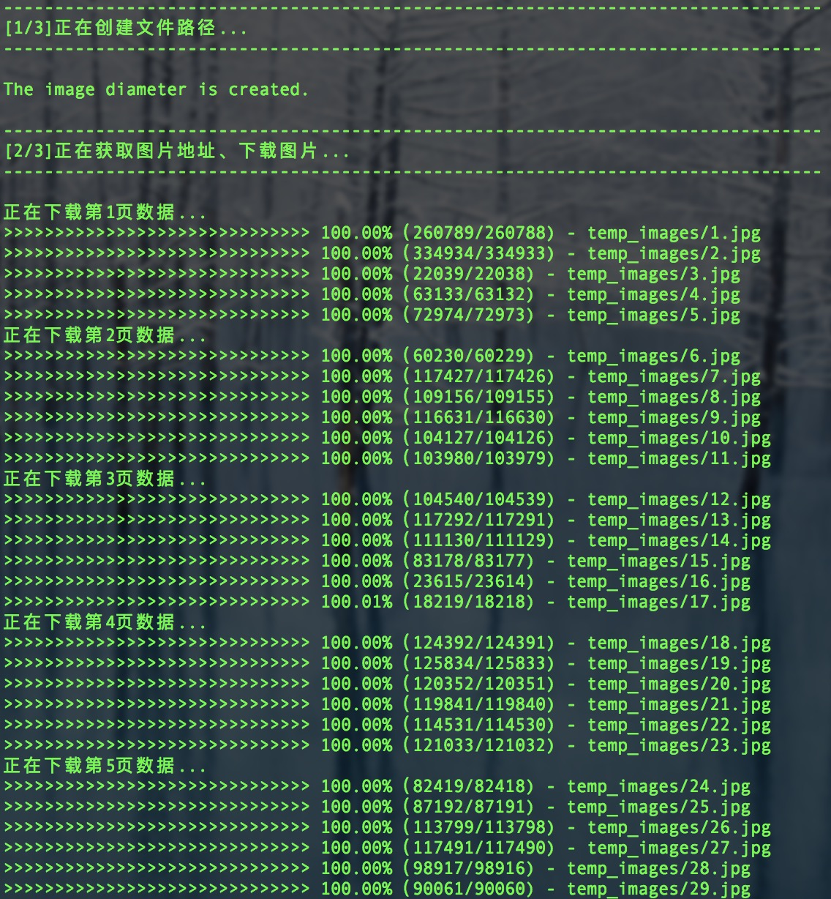
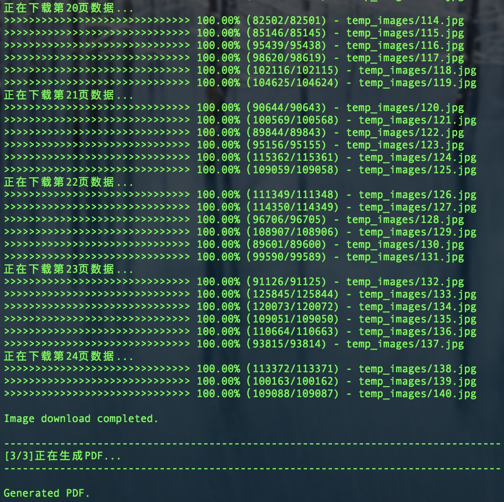
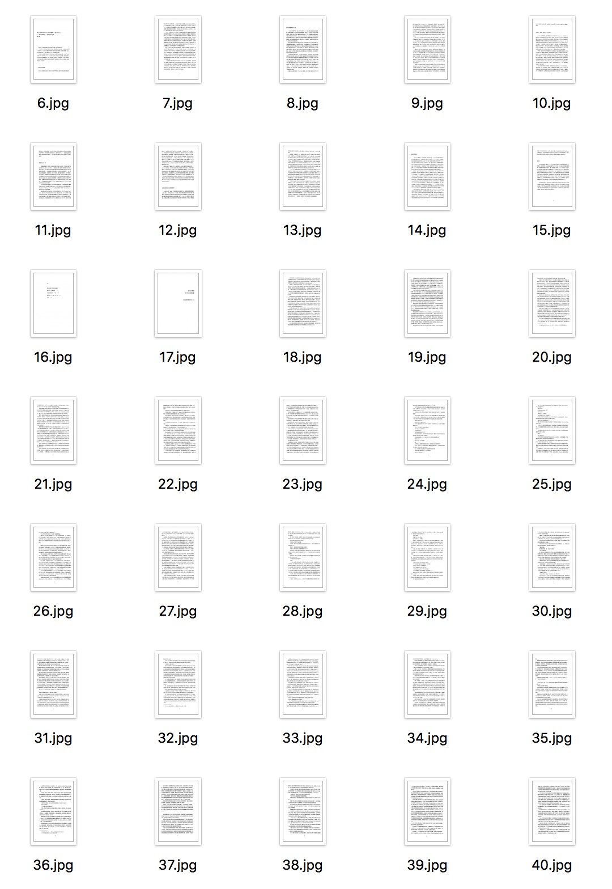

# dlPDF
The sadness of a joke（悲伤的笑话）

### 故事简介

  开始觉得《赎救的克申肖》好好看，听说和书上写的有些地方不太一样，就想着找找电子书看，结果找来找去都是不完整的，（文件大小一看就看出来了）之后在某网站上看到有在线版的，看着是应该没啥问题，就想着能不能下载下来看，网站上全是由一张张的图片组成，就想着把所有的图Down下来，于是就开始行动了〜
  
  写完的时候还蛮激动的，这以后还想看啥就下下来，多方便啊！当我认真的等执行完毕的时候，咦〜
  
  咦〜咦〜咦〜〜〜〜〜〜...
  
  咋停了呢，不应该啊〜我记得还有很多呢。一看接口到后面就不给返回的空数据，难道说后面的不给数据了，还是要验证用户或VIP数据的token。当时我的内心，那绝望啊〜哭晕到厕所了〜
  
  看着正在生成的文件，内心那个挣扎，难道要我看一半的书？这也太难受了吧！
  
  静静地想了想，既然已经这样了，那就让大家一起乐乐呗〜

### 执行流程图

### 下载&&生成文件图

